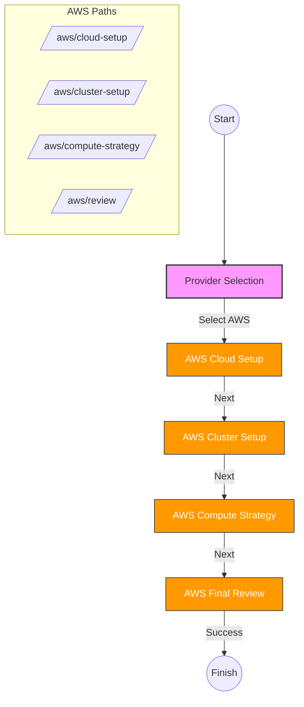
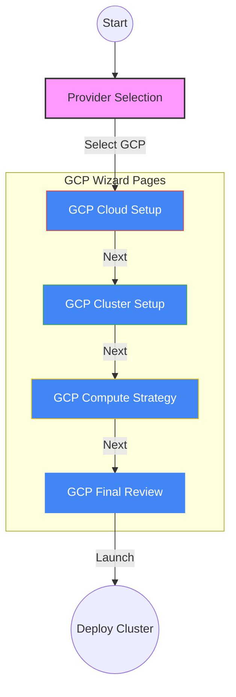

# UI Demo: Cluster Setup Wizard

This directory contains the user interface for the cluster creation platform. It abstracts the underlying Terraform and Batch job complexities into a user-friendly, multi-step wizard.

## Setup Flows

The UI supports two main cloud providers: AWS and GCP. Both follow a similar architectural pattern but use cloud-specific components and validation logic.

### AWS Setup Flow

### GCP Setup Flow

## Running Locally

1. `cd ui`
2. `npm install`
3. `npm run dev`
4. Visit `http://localhost:3000/musical-couscous/`

*Note: The `basePath` is currently set to `/musical-couscous/` in `next.config.mjs`.*
